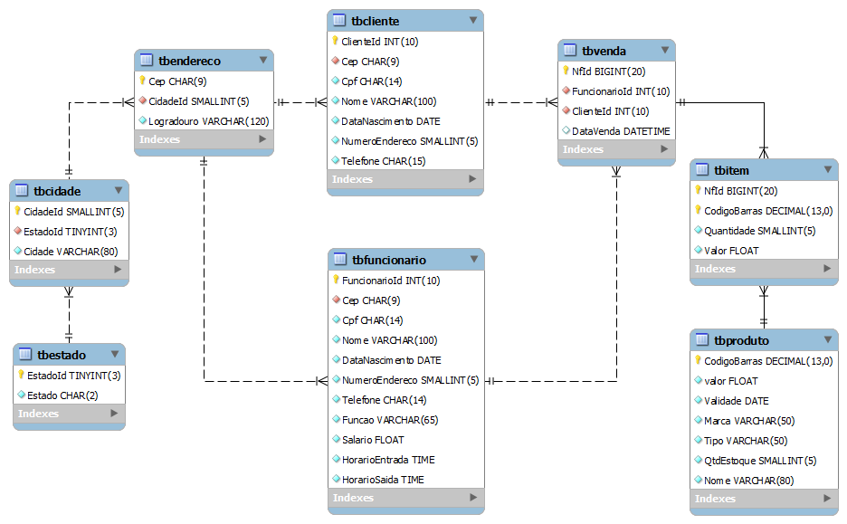

<h1 align="center">
    
    
DB Geral

</h1>

## 🗃️ About

Banco de Dados Geral is an experimental web application consisting of a CRUD with PHP and SQL, hosted for free.

It aims to be a storage in which small merchants record their business data. On the platform, the user can register their customers, employees, addresses, products, sales and suppliers; after registering them, it is possible to consult, edit or delete them.

It was done in 2021 as a Database exercise, at the time I was studying SQl and had basic knowledge of Javascript, HTML and CSS.

Access the Banco de Dados Geral through [this link](https://basegeral.000webhostapp.com/)!

---

## 💻 Technologies

* PHP;
* SQL;
* HTML5;
* CSS3;
* Javascript.

---

## 📋 Logic Data Model

    

---

## 🌐 Demonstration

    

